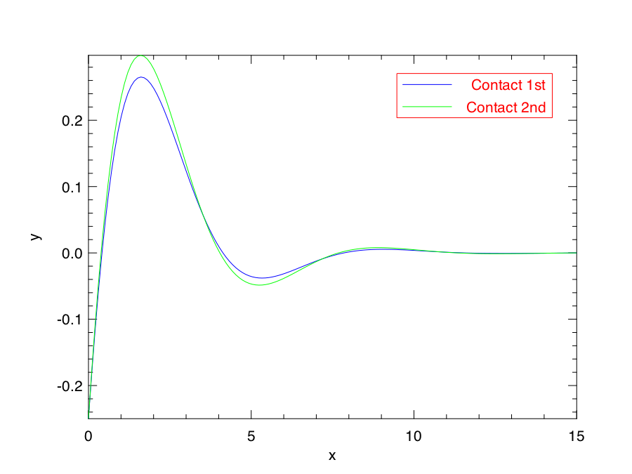
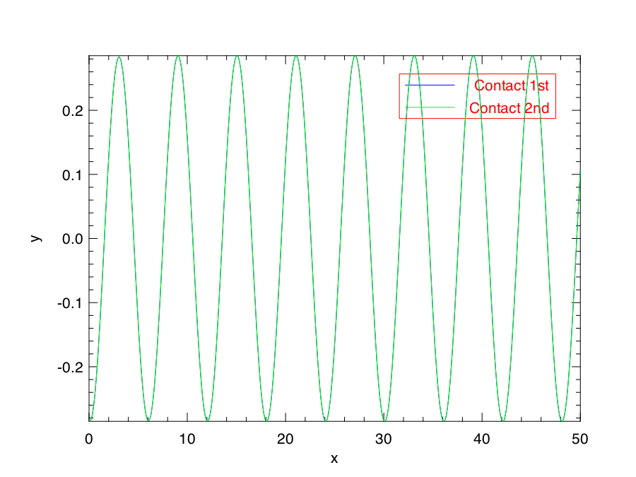

# Contact variational integrators - native ocaml implementation

This is a collection of geometric solvers for initial value problems derived from contact Lagrangians.
The provided solvers concern Lagrangians of the form
$$                                         
L(x, \dot{x}, z, t) = \frac12|\dot{x}|^2 + g_1(x)g_2(z) + h(z) + f(t)\dot{x}
$$
For further information refer to _Vermeeren, Bravetti, Seri: Contact Variational Integrators (2019)_.

Running the integrators on the damped oscillator with and without forcing (see [example/damped.ml](example/damped.ml)) produces the following output:

